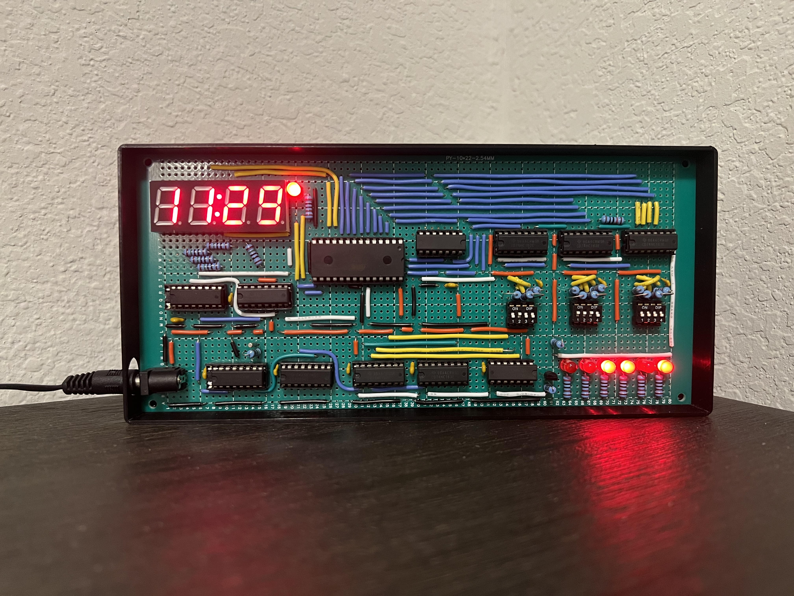
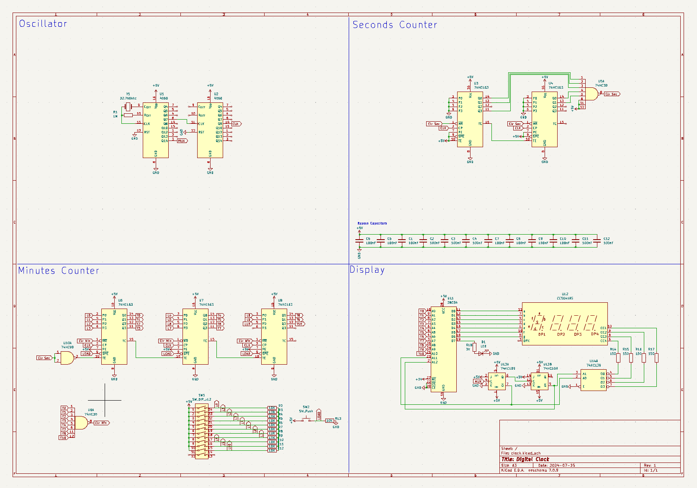
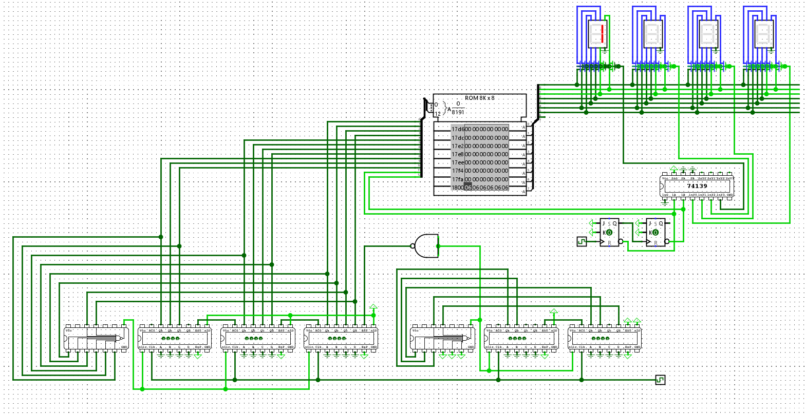
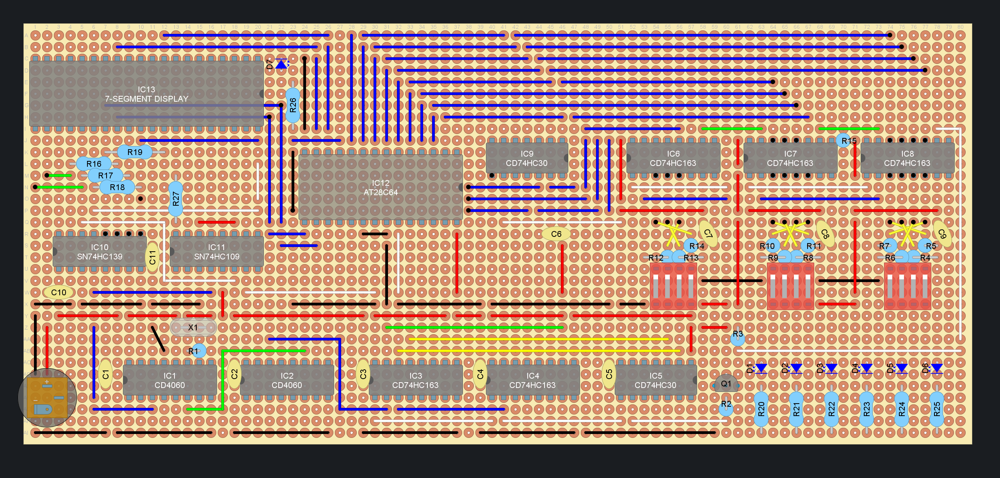

# Digital Clock

These are the files for a digital clock I built for fun using CMOS digital logic integrated circuits. This project was started during the summer of 2023 and fully finished by the spring of 2025.

## Features
- 7 segment LED display
- Setting the time using binary
- AM/PM Indicator LED
- Binary counter displaying seconds
- Powered via 5V DC barrel jack

## Photos and Screenshots

## Component List
- __1x__ [AT28C64B-15PU 64kbit EEPROM](datasheets/at28c64b.pdf)
- __1x__ [SN74HC139 2:4 Line Decoder](datasheets/sn74hc139.pdf)
- __1x__ [SN74HC109 JK Flip Flop](datasheets/sn74hc109.pdf)
- __2x__ [CD4060BE Binary Divider and Oscillator](datasheets/cd4060b.pdf)
- __2x__ [CD74HC30 8-input NAND Gate](datasheets/cd74hc30.pdf)
- __5x__ [CD74HC163 4-bit Binary Counter with Sync Clear](datasheets/cd74hc163.pdf)